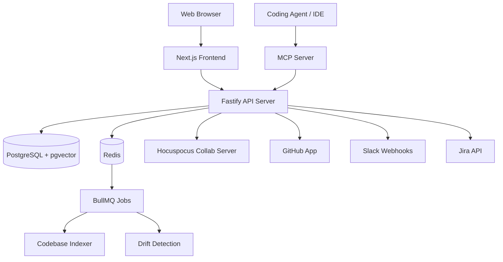

# OpenFactory

Open-source AI-native SDLC orchestration platform.

OpenFactory guides software teams through a structured pipeline — from requirements to architecture to implementation to feedback — with AI agents that enforce rigor at every stage and a knowledge graph that keeps everything connected.

## Features

- **Refinery** — AI-assisted product requirements. Transform ideas into structured PRDs with collaborative editing, versioning, and agent review.
- **Foundry** — Technical blueprints with drift detection. Design architecture that stays synchronized with your code.
- **Planner** — Work orders with MCP integration. Decompose blueprints into tasks your coding agent can execute directly from the IDE.
- **Validator** — User feedback loop. Capture feedback via API, auto-categorize, and generate GitHub/Jira issues.
- **Knowledge Graph** — Connected artifacts with automatic change propagation and drift alerts.
- **Self-Hosted** — Your data, your LLM provider, your infrastructure. Supports OpenAI, Anthropic, and local models via Ollama.

## Tech Stack

| Layer | Technology |
|---|---|
| Frontend | Next.js 16, TipTap v3, shadcn/ui, Tailwind CSS v4 |
| Backend | Fastify, Drizzle ORM, PostgreSQL + pgvector |
| AI | Vercel AI SDK v6, tree-sitter, BullMQ |
| Real-time | Yjs + Hocuspocus (CRDT) |
| IDE Integration | Model Context Protocol (MCP) |
| Auth | Better Auth |

## Quick Start

```bash
git clone https://github.com/your-org/openfactory.git
cd openfactory
pnpm install
cp .env.example .env  # Configure your LLM API keys
docker compose up -d  # Start PostgreSQL + Redis
pnpm db:migrate       # Run database migrations
pnpm dev              # Start all services
```

Open http://localhost:3000

## Architecture



## Modules

| Module | Purpose | Key Capabilities |
|---|---|---|
| **Refinery** | Product requirements | PRD editor, feature management, agent review, import/export |
| **Foundry** | Technical blueprints | Architecture specs, Mermaid diagrams, drift detection, templates |
| **Planner** | Work order management | Task decomposition, phase planning, MCP for IDE integration |
| **Validator** | Feedback loop | API ingestion, AI categorization, GitHub/Jira issue generation |

## Project Structure

```
packages/
  web/          Next.js frontend application
  api/          Fastify API server
  shared/       Shared TypeScript types and Zod schemas
  mcp-server/   MCP server for IDE integration
docker/         Docker Compose deployment
```

## Contributing

See [CONTRIBUTING.md](CONTRIBUTING.md) for development setup and guidelines.

## License

[AGPL-3.0](LICENSE)
